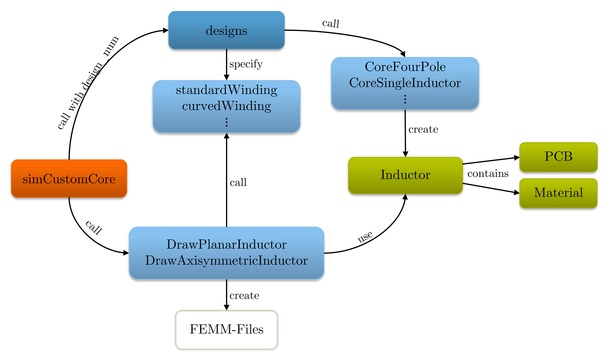
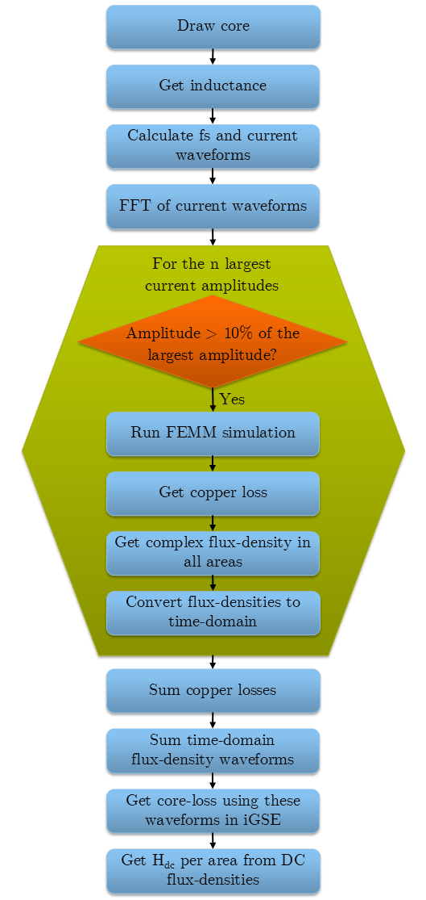

# Planar Inductor Toolbox
Toolbox to simulate high-frequency planar inductors using Matlab and FEMM. Matlab calls **FEMM** and fully controls it, including drawing, setting up the analysis, and obtaining results. An extension to planar transformers should also be possible with minimal modifications. The software can be divided into two categories: Drawing the geometry in FEMM; and running and evaluating the simulation.

An overview of the drawing process is given in the figure above. `simCustomCore` is the heart of the software. This is the script that needs to be executed when simulating a design. It makes a call to `designs` with the desired design specified by `design_num`. Each design with its unique `design_num` consists of a set of parameters that fully describe it plus a winding function that will be used later to draw the windings (e.g. `standardWinding`, `curvedWinding`). Once the parameters have been specified, `designs` calls a function that is specific to the geometry (e.g. `CoreFourPole`, `coreSingleInductor`). This function creates an array of rectangular areas that will be used later to draw the core along with names of the areas. 
When a new design is simulated for the first time it makes sense to choose the minimum number of rectangles required to make up the core. However, as those rectangles (or areas how they are called later) are evaluated by the software and their average flux-density is taken, it is important that their flux-density is relatively uniform. Therefore, it probably makes sense to choose a finer separation once the design has been simulated once and the flux-density can be seen. 
The core function also needs to specify some other properties like symmetry. In the end, an `Inductor` object is returned. Afterwards, the drawing functions `drawPlanarInductor` and `drawAxisymmetricInductor` are called which take the rectangular areas in the `Inductor` object and create the core in FEMM. They call the winding function to get the desired shape of the windings. This completes the drawing process.  

The figure above shows a simplified flowchart of the software. First, the core is drawn as just explained. Self- and mutual-inductance are determined by exciting one winding at 1.5 MHz and dividing flux linkage of each coil by the exciting current. From self and mutual inductance the coupling-factor can be calculated.
For the axisymmetric simulation, there is only one coil so only self-inductance can be determined. It uses the coupling-factor from the planar simulation for the next steps.  
Using the inductance and coupling-factor, the switching frequency is calculated. A desired negative current is specified such that the required ripple only depends on the desired output current.  
Next, the current waveforms are calculated. Transistor conduction loss is immediately calculated using the RMS-current. Required input and output capacitance are also calculated.  
In order to obtain core losses, the flux-waveform of each area is required. It would be convenient to run a transient simulation with the actual waveform but FEMM can only perform sinusoidal simulation. Therefore, an FFT of the current waveform is performed. The result of the FFT is sorted by absolute amplitude. Simulations are run for the first n frequencies or until the absolute amplitude is less than 10% of the largest amplitude. The simulations are set up using the complex current amplitude and frequency. It is important to use the complex amplitude, not just the absolute value as the phase-shift between the two currents has a large influence on the flux distribution. For each simulation, the copper losses are obtained. Furthermore, each core-area is evaluated and the complex flux-density in x and y direction is saved. The complex flux-densities are then converted to time-domain waveforms using the inverse FFT. After all harmonics have been analyzed the total flux-density waveforms for x and y direction can be calculated. The iGSE is used to get the core-loss from these summed waveforms. Lastly, Hdc is calculated by taking the DC flux-densities and dividing by the permeability.  

For each design, the results are saved in a separate file. An evaluation script reads all the data and provides a tabular summary. Furthermore, all simulation files are uniquely named such that they can be reviewed later. The system also automatically checks if a certain simulation has already been computed and if so reuses the files.  
To simulate a new geometry, users just need to create a new function that takes a set of parameters that fully describe the geometry and returns a set of rectangular areas that make up the core in planar and axisymmetric simulation. `CoreFourPole` and `CoreSingleInductor` serve as examples.

## Getting started with the inductor design software
Before using the software you need to install [FEMM](https://www.femm.info/wiki/HomePage). Next, use Matlab's interactive `pathtool` to add the `mfiles` directory (typically located at *C:\Program Files\femm42\mfiles*) to the search path. More information can be found in the OctaveFEMM Manual. It is highly recommended to refer to the manual if you encounter trouble with this script.

## Key Files

<strong>simCustomCore</strong>

This script is the heart of the program. It calls all the other functions and executes the algorithm described above. Run this script to simulate a design. 

<strong>designs</strong>

All designs are specified here. A design is a fully parametrized core of a certain geometry. Each design, with its unique design number, consists of:
<ul>
<li>A set of parameters that fully describe it</li>
<li>A winding function that will be used later to draw the windings</li>
</ul>

Implemented winding functions:
<ul>
`standardWinding`
`standardWindingEdge`
`curvedWinding`
</ul>

Once parameters are specified, `designs` calls a geometry-specific function that:
<ul>
<li>Creates an array of rectangular areas for core drawing</li>
<li>Names the areas</li>
<li>Specifies properties like symmetry</li>
</ul>

Implemented core functions:
<ul>
`coreSingleInductor`
`coreFourPole`
</ul>

An <strong>Inductor</strong> object is returned.

<strong>drawPlanarInductor</strong> and <strong>drawAxisymmetricInductor</strong>

These functions take an `Inductor` object and use it to create the design in FEMM.

<strong>simulationParameters</strong>

This file controls the behavior of `simCustomCore` and the FEMM solver, specifying parameters such as operating point and desired ripple.

<strong>Message</strong>

To not only print to the console but also store output in a logfile, `simCustomCore` creates a `Message` object that prints to the console and saves to the logfile simultaneously.

<strong>evaluateDesigns</strong>

After simulating a few designs using `simCustomCore`, use this script to compare them.

## How to Simulate a New Geometry

1. Identify the relevant parameters that fully describe the new geometry.
2. Add a new design to the `designs` file with these parameters.
3. Create a new core file similar to `coreSingleInductor` or `coreFourPole` that uses the parameters to create an `Inductor` object. It must calculate the rectangles for planar and axisymmetric simulation and calculates the other `Inductor` properties.
4. Update `simDesign` in `simCustomCore` to the new design number.
5. Run the simulation.